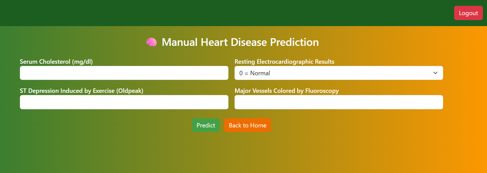

❤️ Heart Disease Prediction using ACO & Machine Learning

## Overview

This project focuses on predicting heart disease using an intelligent framework that combines Ant Colony Optimization (ACO) for feature selection with Machine Learning classifiers for accurate prediction.

The system improves performance by removing redundant and noisy features, resulting in better accuracy, efficiency, and interpretability.

## Objectives

Predict heart disease using clinical data

Select optimal features using ACO

Reduce redundant and irrelevant features

Improve model accuracy and efficiency

## Methodology

Data Preprocessing

Handle missing values

Apply StandardScaler for normalization

Feature Selection (ACO)

Uses pheromone-based optimization

Selects the most relevant features

Model Training

Random Forest

Support Vector Machine (SVM)

Model Evaluation

Accuracy

Precision

Recall

F1-Score

Stratified 5-Fold Cross Validation

## Key Features Selected

Serum Cholesterol

Major Vessels (Fluoroscopy)

ST Depression (Oldpeak)

Resting ECG Results

## Results

Achieved 98.6% accuracy using Random Forest

Reduced feature set significantly

Improved computational efficiency and interpretability

## Tech Stack

Python

Scikit-learn

Pandas, NumPy

Matplotlib / Seaborn

ACO Algorithm Implementation

## Screenshot

